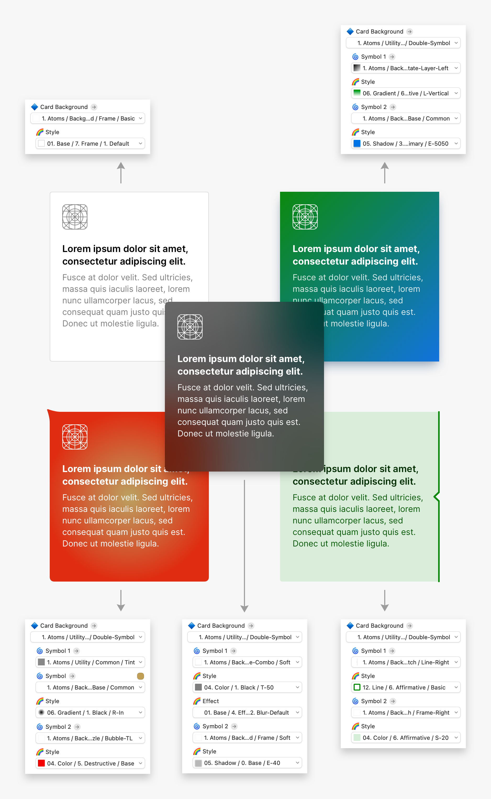

# GO UI Design System

> :warning: *This repository **does not contain actual Sketch files** but unzipped JSON sources. To download the Sketch files, please see the [release][release] page.*

GO UI Design System is aimed to create rapid UX & UI designs for large scale projects. 
It can not be considered as a UI Kit itself, instead it helps to create uniqe UI kits and manage them easily.

The system combines the power of Sketch's styles and symbols to create highly functional components to be used along your design process in a large range of needs.

## [Add Library to Sketch][library]

[library]: sketch://add-library?url=https%3A%2F%2Fraw.githubusercontent.com%2Fozgurgunes%2FGO-UI-Design-System%2Fmaster%2Fsketch-library.rss
[release]: https://github.com/ozgurgunes/GO-UI-Design-System/releases/latest/

Because of Github does not generate links for custom protocols like sketch://; please copy & paste the url below, to your browser address bar.

```
sketch://add-library?url=https%3A%2F%2Fraw.githubusercontent.com%2Fozgurgunes%2FGO-UI-Design-System%2Fmaster%2Fsketch-library.rss
```

## Contribute

This repository uses Git hooks to commit, push & pull Sketch files as unzipped JSON sources. Fortunately, there is a small script to setup Git hooks for you automatically.

Run following commands to clone the repo and setup hooks.

```
% git clone --recursive git@github.com:ozgurgunes/GO-UI-Design-System.git
% cd GO-UI-Design-System
% ./_hooks/setup.sh
```

Your clone is ready for Git actions. Checkout anything to generate Sketch files. You can use your favorite Git client also.

```
% git checkout master
```

## Getting Started

GO UI Design System relies on Brad Frost's atomic design concept. It uses atom, molecule, organism and template symbols to replicate design patterns or create originals.

Styles and symbols are named carefully for reducing the effort on navigating Sketch’s flyout menus to minimum.

The hierarchy has been structured by taking the usage pattern and frequency into account, such as switching to contextual alternates or variations easy and fast.

### Background Symbols

The library provides several functional background atoms to make molecules, organisms and templates highly customizable with symbol overrides.
It is possible to change a components corner radius, mixing gradients, adding shadows or even create new colors with just overriding and styling the background atom of it.



### Assets & Supplements

Many molecules use asset and supplement atoms to extend their purpose and functionality. 
Assets and supplements consist of one or more text boxes usually with an icon in different sizes. 

Assets are primary content of a molecule; like a text box with an icon aligned to left. Supplements are secondary contents like a dropdown icon or chevron aligned to right even with a text box.

This structure allows to create a wide range of design pattern variations with only a few molecule symbols by overriding its atoms thus making project-wide changes so easy and fast.


### Customizing Symbols

The symbols, library provide, mostly need customizatons for a complete elegant design.
It’s possible to create a new symbol without detaching it from the library, after customizing its components and styles by overriding.

The main advantage of this method is, editing a symbol in the library also syncs the project document as well.
This may cause some minor performance disadvantage because of using too many nested symbols in design.

On the other hand, for more advanced customization and better performance, we can make the symbol local for document, by detaching it from the library.
With this way, as a disadvantage, making a change in the library will not be reflected to the project.

## Color System

### Base Colors & Elements

A total of 8 base colors have been defined in the system as black, white and 6 contextual colors.

Library have some dark & light shades and transparency definitions as element colors, which are used in components for texts, backgrounds and objects like separators or chevrons.

S1 and S2 colors are for giving a small distinction to elements from background or siblings such as alternating table rows, highlighted cards etc. 
T1 is used for background dimmers and background blurs. 
T2 is used for secondary texts. 
T3 is used for list detail chevrons. 
T4 is used for tertiary texts. 
T5 is used for separator lines and some backgrounds like scrollbar etc. 

Naming these colors as black and white have been avoided and used the names as “default” and “inverse” instead. Thus if a Sketch document switch between two or more libraries for color themes such as light and dark, colors may remain semantically consistent.

### Solid Colors

All contextual base colors have a contrast ratio of at least 4.5:1 with both black and white.
Color tones are created by adding blacks and whites on a base color.
Each color except black and white has 8 tones including 1 base color, 3 dark tones and 4 light tones.
The black and white opacity values added to the base color shown on the color wheels.
Tones are named in multiples of 10 with 50 being the base color and an S prefix as abbreviation of solid.
This allows to create semitones like S-35 whether needed.

### Opacities

Each color also have 8 pre-defined opacities in the system. 
Opacity values are same for all colors and named with a T prefix as an abbreviation of transparent.
Color opacities, except black and white, are named with 4 digits; first 2 represent the color tone, second 2 represent the opacity of tone. Thus, its possible to create a blue T-7030 when a transparency of darker tone is needed.
Since there are no tones of black and white, only 2 digits used for their opacities.

## Layer Styles

### Background Layer Styles

There are 53 defined layer styles for using to set a quick background to elements and components.
Divider, column and grid styles use 1px inner shadow in Divider Color.

### Button Layer Styles

There are 6 contextual button styles with their states.
The library also have 5 additional button styles for custom needs.
Neumorphic buttons also created for experimental purposes by using Sketch specific shadow and layer blend features to use on any background color.

### Text Input Layer Styles

The library have 2 types of input styles with their states and default fill alternates. Material Design's Floating input styles use -2px inner shadow on Y axis to create the underline.

### Gradient Layer Styles

All colors have 8 gradient styles for general purposes. 4 Angulars (to both directions), 2 Linears and 2 Radials.

### Shadow Layer Styles

Each color have 8 shadow styles for different levels of elevation.
Base shadows don’t have a fill, so they could be applied on layer groups as a symbol override.
There is a slight color overlay on contextual colors elevations.
Similar to opacities, shadows are named with 4 digits.
First 2 represent the color tone and second 2 represent the elevation level, which makes possible to create an elevation of light blue like E-2040.

### Border Layer Styles

All colors have 6 layer styles for borders, inluding 3 inside border styles and their 10% filled variations.

### Line Layer Styles

All colors have 6 layer styles for lines, inluding 3 center border weights and their dashed variations.

### Divider Layer Styles

Each color have own divider styles with 6 different fills.
Divider lines created by -1 px inner shadow on Y axis in base color with 50% transparency.

### Frame Layer Styles

Each color have own frame styles with 6 different backgrounds.
Frame borders are in 1px inside base color with 50% transparency.

### Grid Layer Styles

Each color have own grid styles with 6 different fills.
Grid lines created by -1 px inner shadow on X axis in base color with 50% transparency.

### Table Layer Styles

Each color have own table styles with 6 different fills.
Table lines created by -1 px inner shadow on both axes in base color with 50% transparency.

### Utility Layer Styles

Library also have some utility layer styles to use mostly outside UI such as style guides, spec documents, diagrams etc.
Desaturator desaturates any color behind it.
Image placeholder is filled with a transparent image file. Any layer with this style in components can be overridden with real images during design process.

## Text Styles

### Basic Text Styles

The library has a total of 288 basic text styles for using in components and design elements.
There are 8 font sizes including 1 base size, 4 larges and 3 smalls.
All sizes have 4 weights including regular, bold, heavy and light.
All of these have both horizontal and vertical alignment variations which makes a total of 9 for each.
These are the basic text styles which library provides for general purposes or wireframing.
Most likely, every project will have its own text styles with different font, weight and even colors.
Text styles in symbols can be overridden by custom text styles without any problem as long as they preserve the same line heights.
Different line heights may cause some vertical alignment problems in some symbols such as buttons and form fields.

### Display Text Styles

The library has a total of 288 display text styles for using in components and design elements.
There are 8 font sizes including 1 base size, 4 larges and 3 smalls.
All sizes have 4 weights including regular, bold, heavy and light.
All of these have both horizontal and vertical alignment variations which makes a total of 9 for each.
These are the display text styles which library provides for headings and titles.
Most likely, every project will have its own text styles with different font, weight and even colors.
Text styles in symbols can be overridden by custom text styles without any problem as long as they preserve the same line heights.
Different line heights may cause some vertical alignment problems in some symbols such as buttons and form fields.

### Article Text Styles

The library also have separate text styles for long text contents such as articles and blog posts.
These styles are named according to their HTML equivalents and have little more line heights than basic texts to provide better readability.

### Button Text Styles

Library have separate text styles for various button types and their disabled states.

### Input Text Styles

Library have separate text styles for various form inputs and their states.

## Symbols

### Buttons

Library have 2 types of smart buttons, regular and slim, and 3 sizes of them.
It doesn't have contextual button symbols like primary or ghost, nor their states like disabled or hover. 
Instead of this, it makes styling the buttons very easy for any contextual needs.
Slim buttons are ideal for tab bars toolbars.

#### Common & Icon-Only Buttons

Library also provides common and icon-only buttons.
These buttons don't have any smart layout settings, so can be used in any size.
Complex buttons use assets and supplements, so they are highly customizable to use in a wide range of custom button needs.

#### Button Styling

Button background and text styles are named specially to make overrides in a quick way. 
We can generate 5 contextual buttons and their 5 states very fast and easy.

#### More With Buttons

We can override button background symbol to create different types of buttonsets very fast.
We can use flat buttons in a tab bar with spacing, or use regular buttons for contiguous tabs by overriding their backgrounds symbols to base or none.
Buttons named “common” don’t use Sketch’s smart layout feuture. We can use them for giving a custom width to our buttons.
Complex buttons use assets and supplements. Usage areas of those are totally up to our imagination.

### Cards

Regular cards wraps an image placeholder adjacent to edges and a card asset with padding. 
They have 3 image alignment and 2 padding options for each. Defaults have 16px padding and larges have 24px padding with a slight larger images.
Common cards don’t have their own image placeholder but a card asset.
They have a slim (0px padding) version in addition to default (16px padding) and large (24px padding) sizes.

#### Card Footers

Card molecules also have a footer placeholder which extends their functionality further.
We can use footers for a wide range from adding a simple call to action to appending an extra content.
Footers have their own backgrounds which could be used to separate it from the cards content with a divider or giving some extra stylish look.

### Forms

The library provides classic outlined form fields in 3 sizes. 
Each field type has an icon version aligned to left. 
Text fields have right icon and text align versions.
All fields excepr select fields have a placeholder cursor founcdation to simulate focus state. 

#### Floating Label Fields

The library provides Material style floating label form fields.
Each floating label fields has inactive and activated state symbols separately. 
Inactive states has mandatory foundations which moves along the label text using Sketch's smart layout feeature.
All active state symbols except select fields have placeholder cursor foundation at the beginning of the input text.
Text fields also have a typing cursor foundation which moves along the input text using Sketch's snart layout feature.

#### Table View Fields

Library provides 3 iOS style table view field symbols and their slim (0px padding) versions.
All fields have placeholder and typing cursor foundations. 
Input text also move along the label text like cursors using Sketch's smart layout feature.

#### Field Styling

All field states could be easily applied by overriding fields background and input text styles.
Supplements could be used to add an icon for feedback on some states such as invalid.

#### Form Groups

The library provides form groups to save us insert field labels and helper assets separately. 
All form groups have 2 variations named as smart and textarea.
Textarea groups are for giving a custom height to multiline fields.
Smart groups also could be used with smart textarea fields to set symbol height automatically to fit content using Sketch's smart layout feature.

### List Items

List items are probably the most used molecules in the library in design process.
They could be used in a wide range of design needs such as iOS table views, sidebar navigations, dropdown menus and more.
They have 16px padding from left and right sides, their content is vertically aligned to middle (except header and footer) and heights set manually.

#### Slim List Items

Slim list items are pretty much same as regular list items but have no padding from left and right.
They can be pretty handy especially for web content like definition lists or search results with relevant assets.

#### Specific List Items

The library also has some specific list item molecules.
Hierarchical lists useful for subnavigations or any other hierarchical contents.
Swipe lists contain another list molecule which could be overridden to match to other items in the list.

### Other Useful Molecules

#### Notifications

Library have 4 notification symbols to use in various cases.
Basic notification, which doesn’t have an asset but text box, could be used to display simple feedback messages.
Others use assets to make notification content richer and customizable.
There is a notification symbol with section footer molecule which could be used for converting notification panel to a simple alert dialog.
Tint assets also could be used to give the notification panel a more stylish look using dark contextual text colors, which are not exist as a text style in the library.

#### Chips

Library have 3 type of chip molecules with their removable alternates.
The customizable structure of chips make them possible to be used in a wide range of cases such as tags, badges, selection options, filtering criterias etc.


#### Tooltips

Because of customizing the background and content is so easy, the library provides only 2 tooltip symbols, which are basic and complex.
Basic tooltip has only a text box.
Complex tooltips use assets and have a dismiss button on top right corner.
Both tooltips have been set smart layout vetically, so overriding the text or asset resizes the tooltip to fit content automatically.

#### Progress Bar

Library doesn’t have progres bar symbols but the steps.
There are 2 types of progress bar steps, thumb and pill, with their state variations.
Thumb steps have their own lines in both sides which could be hidden for first and last ones by overriding their styles.
Pill steps could be used in front of a line such as split background atom.
The library also provides simple bar symbols to simulate every steps in 10:10 or 12:12 ratios.

#### Messages & Comments

Library have some basic message and comment molecules which could be used directly by customizing overrides or made local for document for advanced customization.
All symbols have been set smart layout to vertically, so any text override will resize them to fit content automatically.

### Pre-Built Organisms

#### Calendars & Dropdowns

The library have several calendar and dropdown organisms for a quick use, more as afoundation.
Because of its hard to customize complex organisms like calendars, they could be made local and customized directly on the local symbol.

#### Card Carousels

Library have pre-build resizable card carousels for desktop and mobile screens with their start & end variations.
Carousels could be used directly from library by overriding the cards or made local for more customization.

#### Modals

There 4 pre-built modal organisms for both desktop and mobile screens.
Alerts have Sketch’s smart layout setting to vertically middle, so, it always stay at the center of the page when the message text overridden.
Other windows dont have a smart layout setting, they could be set to any size.
Modal windows content asset also be overridden by any seymbol or set to none for a non-symbol content.